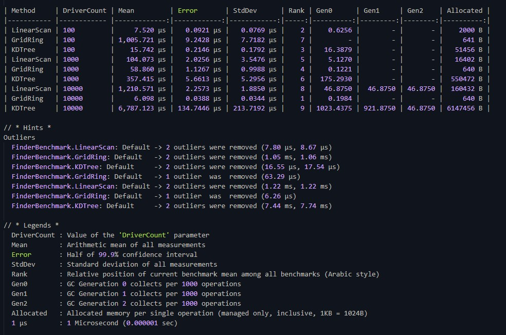

# Система подбора ближайших водителей

Реализация механизма поиска 5 ближайших водителей на прямоугольной сетке размером **N × M** с использованием трёх различных алгоритмов и сравнением их производительности.

# Описание задачи

- Карта представляет собой прямоугольную сетку `N × M`, где `0 <= X < N`, `0 <= Y < M`.
- Каждая клетка может содержать не более одного водителя.
- Для заданного заказа (координаты `X`, `Y`) необходимо найти 5 водителей с минимальным расстоянием до заказа.
- Расстояние вычисляется по евклидовой метрике:  
  `d = √((x₁ - x₂)² + (y₁ - y₂)²)`.

#Реализованные алгоритмы

 Алгоритм: **LinearScanFinder** 
 Сложность: | O(D) | 
 Особенность: | Полный перебор всех водителей с последующей сортировкой. Простой и надёжный для небольших D (< 1000). |
 
 Алгоритм: **GridRingFinder** 
 Сложность: | O(k·r²) | 
 Особенность: | Поиск волнами (кольцами) от точки заказа по манхэттенскому расстоянию. Эффективен при высокой плотности водителей. |
 
 Алгоритм: **KDTreeFinder** 
 Сложность: | O(log D + k) | 
 Особенность: | Использование KD-дерева для пространственного поиска. Лучшая масштабируемость при большом количестве водителей (D > 10 000). |

> **D** — общее количество водителей, **k** — количество запрашиваемых водителей (5), **r** — радиус поиска.

#Результаты бенчмарков

Сравнение производительности трёх алгоритмов при разном количестве водителей:

# Ключевые наблюдения:
- При **D ≤ 500** быстрее всего работает **LinearScan** благодаря минимальным накладным расходам.
- При **высокой плотности** (D = 1000–10 000) **GridRing** демонстрирует наилучшую производительность, так как находит водителей за несколько шагов.
- **KDTree** проигрывает при малых D из-за затрат на построение дерева, но теоретически выигрывает при очень больших D (требует оптимизации кэширования).

# Тестирование

Проект покрыт unit-тестами с использованием **NUnit**:

- Корректность расчёта расстояний
- Правильный порядок водителей в результате
- Обработка крайних случаев (менее 5 водителей, пустая карта)
